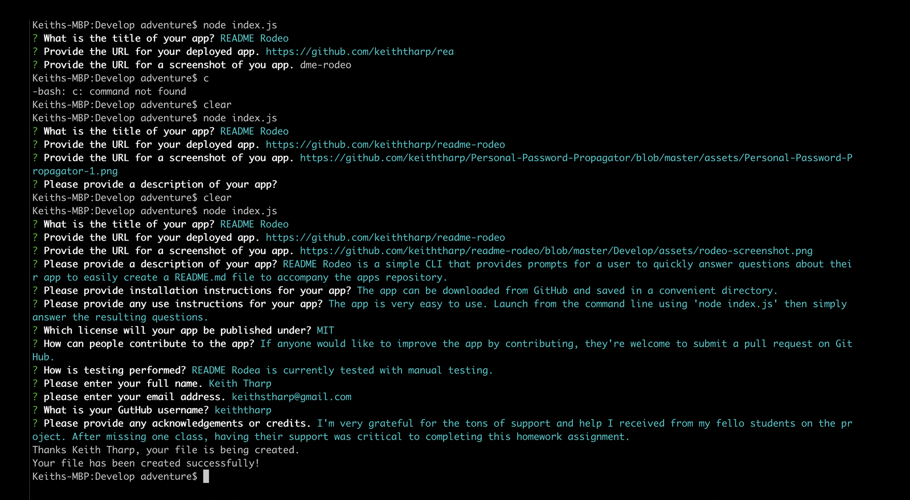

  
  # README Rodeo

  README Rodeo is a simple CLI that provides prompts for a user to quickly answer questions about their app to easily create a README.md file to accompany the app's repository.

**View video of functioning app at -** https://youtu.be/suQlBWO06yQ

## Table of Contents
- [Installation](#Installation-instructions)
- [Usage](#How-to-use-README-Rodeo)
- [Contribute](#How-to-contribute-to-README-Rodeo)
- [Testing](#For-testing)
- [Questions](#README-Rodeo-was-developed-by:)
- [Credits](#Acknowledgments-and-Credits)
- [License](#README-Rodeo-is-licensed-under-MIT)

## Installation instructions
The app can be downloaded from GitHub and saved in a convenient directory.

## How to use README Rodeo
The app is very easy to use. Launch from the command line using 'node index.js' then simply answer the resulting questions.

## How to contribute to README Rodeo

If anyone would like to improve the app by contributing, they're welcome to submit a pull request on GitHub.

## For testing

README Rodeo is currently tested with manual testing.

## README Rodeo was developed by:
- Keith Tharp

Please reach out with questions at:
  - keithstharp@gmail.com

Find more of Keith Tharp's work at:
  - https://github.com/keiththarp

## Acknowledgments and Credits
Thank you to all my fellow students and study groups that helped and supported with this homework project!

## README Rodeo is licensed under MIT
[Click here for more information on the MIT license.](https://choosealicense.com/licenses/mit/)
